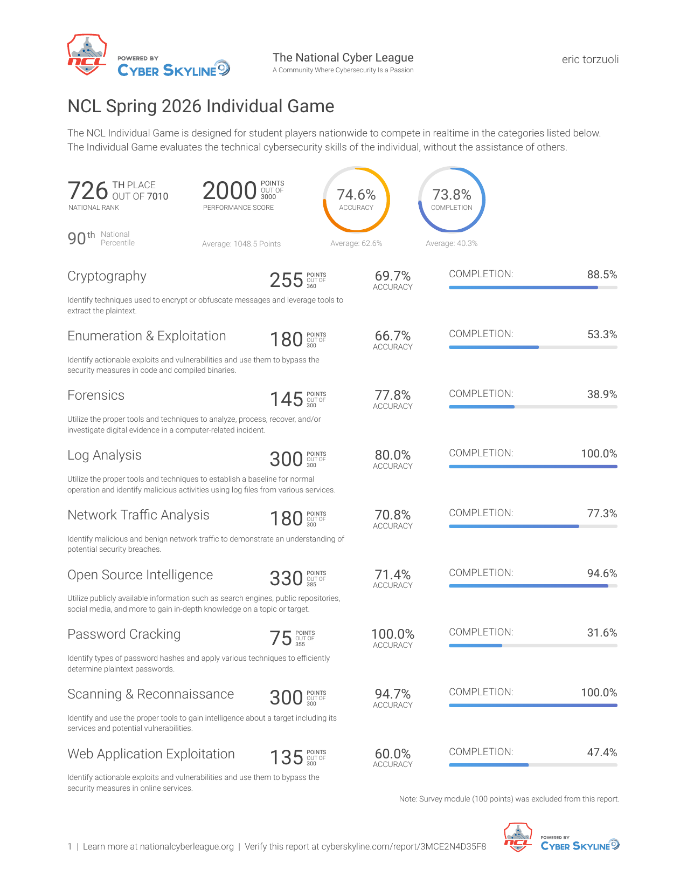
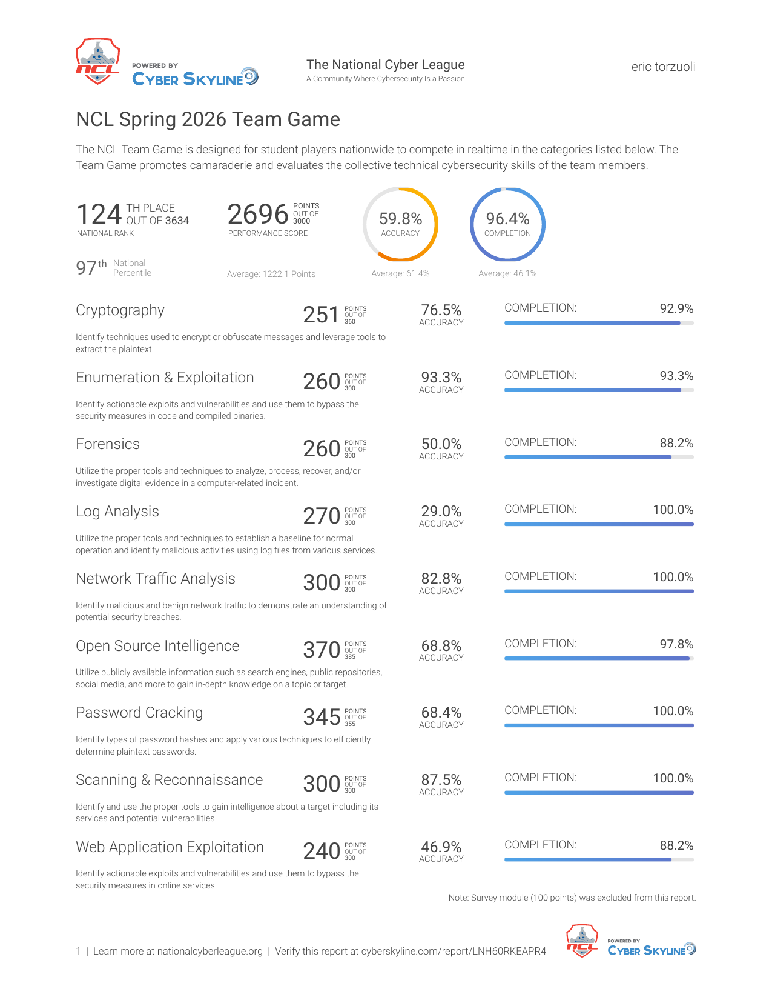

# NCL Spring 2026 Scouting Reports

I played both the Individual Game (April 10–12) and the Team Game (April 24–26) of the NCL Spring 2026 season. The team game was played with my SANS.edu team, "The Log Hunters."

Both reports below are PDFs from CyberSkyline and can be verified at the links provided.

---

## Individual Game

**726 / 7,010 — 90th percentile**

2,000 / 3,000 points · 74.6% accuracy · 73.8% completion · 10 CompTIA CEUs awarded

Top categories: Scanning & Reconnaissance (98th), Log Analysis (95th), Cryptography (90th).

- [Full report (PDF)](./individual-game-report.pdf)
- Verify: [cyberskyline.com/report/3MCE2N4D35F8](https://cyberskyline.com/report/3MCE2N4D35F8)

---

## Team Game

**124 / 3,634 — 97th percentile** with team "The Log Hunters" (SANS.edu)

2,696 / 3,000 points · 59.8% accuracy · 96.4% completion

Top categories: Open Source Intelligence (98th), Log Analysis (97th), Scanning & Reconnaissance (96th).

- [Full report (PDF)](./team-game-report.pdf)
- Verify: [cyberskyline.com/report/LNH60RKEAPR4](https://cyberskyline.com/report/LNH60RKEAPR4)

---

## What stands out

Three categories were perfect or near-perfect across both games: **Scanning & Reconnaissance**, **Log Analysis**, and **Network Traffic Analysis** (300/300 in the team game). These map to the kind of work I describe in [CTF.md](../CTF.md) as feeling natural: picking apart logs and packets to find the thing that doesn't belong. The scorecards back that up.

Password Cracking was my weakest individual category, 74th percentile, 31.6% completion. I cleared the easy hash identification and best64 challenges, then bombed everything medium and up. Accuracy reads 100% because I never submitted a guess, but the completion number tells the real story.

The 7-percentile jump from individual to team game is worth a note. Working with teammates meant I could spend my time on categories I'm strong in (log analysis, network traffic, OSINT) while teammates covered the rest. The takeaway isn't about the score, it's about how I work best in a team where roles are clear, which is the same way SOC tier triage actually runs in production.
